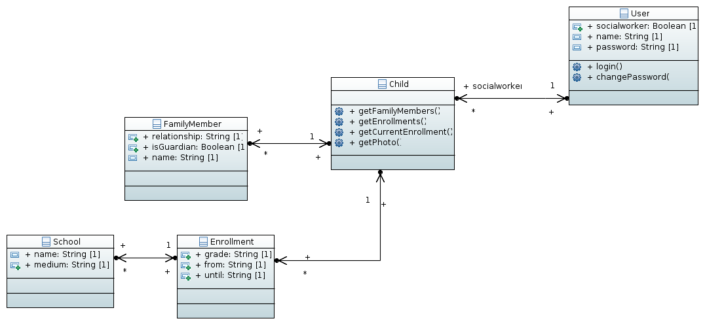

# HELGO DB
Create a simple, offline/sync management system for a small educational NGO.

### Pre-installation
Before proceeding with the installation steps, please check if the following two folder are owned by $USER and not the 'root' user:
`~/.cache` & `~/.config`
If they're owned by root, change the ownership to $USER by running:
`sudo chown -R $USER ~/.cache`
`sudo chown -R $USER ~/.config`
Now, you can proceed with the following commands. (You don't need sudo for any of the commands below.)

## Install

### First Steps
You can simply clone this repository and install the dependencies through [npm](https://www.npmjs.org/) and [bower](http://bower.io):
```
npm install
```

To prepare all necessary files, we are using [grunt](http://gruntjs.com/). The tool was install when running `npm install`. You can directly execute it from the command line:
```
grunt
```

Now you are ready to go. `grunt` has generated a subfolder `/build` that holds all necessary files. If you have a local webserver (e.g. Apache), you can open the web app at `/build/index.html` or `/app/index.html` on your localhost. Otherwise you can start a local server using through `npm`: 
```
npm start
```
The web app is then available in your browser at `http://localhost:8000/app/index.html`

If you need more detailed instructions, please follow the steps from [angular-seed][ng-seed].

### Tools
`npm` and `bower` automatically manage dependencies (i.e. any libraries the project is using).

`grunt` runs the commands configured in `Gruntfile.js`, generating the appcache.manifest (needed to make the app available offline) and minifying the script files.

### Development
All code directly written for the web app itself is in the `/app` folder.

Be sure to open `app/index.html` instead of `build/index.html` in your browser for testing during development. Any changes to the code will only appear for `build/` after running `grunt` again (because this copies the scripts from the `/app` directory to the `/build` directory. To prepare the required libraries running `grunt` is still necessary.


## Architecture

### Overview of Frameworks and Libraries
- JavaScript Web App based on [AngularJS][ng]
  - Started using [Angular Seed project][ng-seed]
- Themed using [Bootstrap][bootstrap]
  - using [angular-ui][angular-ui] as AngularJS integrated Bootstrap library
  - symbols using [Font Awesome][font-awesome]
  - Design originally based on theme [SB Admin 2][bootstrap-sb-admin]
- Local (offline enabled) database through [PouchDB][pouchdb]
  - using [angular-pouchdb][pouchdb-ng] as AngularJS integrated PouchDB library
  - Authentication (username/password) through [pouchdb-authentication plugin][pouchdb-auth]
- Server-side database (automatically synced by PouchDB) running [CouchDB][couchdb]

### Data Model
There is a "model class" for each complex data type saved in the database (e.g. `School` in `app/model/school.js`) and a "manager class" to retrieve a specific instance (or all instances) of that class from the database (e.g. `schoolManager` in `app/model/school.js`).

Overview of the data model design:


#### Child
Holds all information of a child, including photo. Links to `FamilyMember` and `Enrollment` instances.

#### School
Represents a school. Schools are linked to children through `Enrollment` instances.

#### User
Represents staff - i.e. users of the database app as well as social field workers. This is also used to manage login of the app user.


## More Information
For a project outline, free demo system, etc. visit [ngo-db.sinnfragen.org](http://ngo-db.sinnfragen.org/)


[ng]: https://docs.angularjs.org/api
[ng-seed]: https://github.com/angular/angular-seed
[pouchdb]: http://pouchdb.com/api.html
[pouchdb-ng]: https://github.com/angular-pouchdb/angular-pouchdb
[pouchdb-auth]: https://github.com/nolanlawson/pouchdb-authentication
[couchdb]: http://docs.couchdb.org/en/1.6.1/
[bootstrap]: http://getbootstrap.com/
[bootstrap-sb-admin]: http://startbootstrap.com/template-overviews/sb-admin-2/
[font-awesome]: http://fortawesome.github.io/Font-Awesome/icons/
[angular-ui]: https://angular-ui.github.io/bootstrap/
