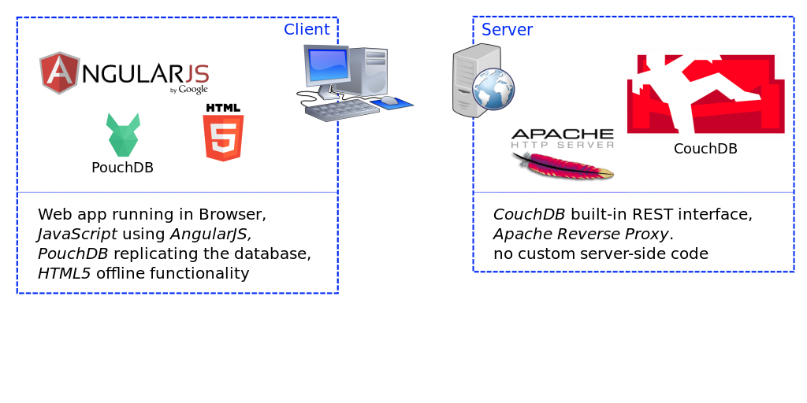
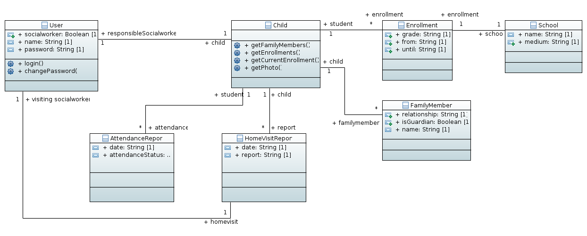

# HELGO DB

[](https://greenkeeper.io/)

Empowering NGOs' social workers with simple to use (database) software.

For a project outline, free demo system, etc. visit [ngo-db.sinnfragen.org](http://ngo-db.sinnfragen.org/)


## Installation

### Pre-installation
The project depends on a couple of tools which are required for development. Please go through the following "pre-installation" steps if you don't have the following tools already installed:

- [npm (NodeJS)](https://www.npmjs.org/)
- [bower](http://bower.io)
- [grunt](http://gruntjs.com/)
- [Yeoman](http://yeoman.io/) (and its AngularJS generator)

#### Installing NodeJS and Requirements (Ubuntu)
If you previously experienced problems with npm it may be a good idea to remove nodejs and npm completely before the installation. This can be done with
`sudo apt-get purge nodejs && sudo rm -r /usr/lib/node_modules && rm -r ~/.npm ~/.node-gyp`

First, we need to install some requirements as we need g++ to compile some node modules and ruby to install the compass module for compiling our SASS code: `sudo apt-get install build-essential ruby ruby-dev`. After that install compass using the package manager of ruby: `sudo gem install compass`.

Installing NodeJS is fairly easy, as there is an official script available which can be found [here](https://github.com/nodesource/distributions#debinstall). The script adds the repository to your sources and you can install using apt-get: `sudo apt-get install nodejs`. NodeJS 5.x should work fine, but if you still encounter any problems you can try to switch to 4.x. 

After NodeJS has been installed, update npm with `sudo npm update -g` and install bower und grunt globally: `sudo npm install -g bower grunt-cli`. The last step is to install [Yeoman](http://yeoman.io/) and a generator for angular projects: `sudo npm install -g yo generator-angular generator-karma`.

### Install Libraries
You can simply clone this repository to get all the code with its configuration and requirements.
Install the dependencies with
```
npm install
```

### Configuration
The needs some basic custom settings to run. These are defined in the file `app/app-config.js`. You can copy the default settings file `app/app-config.js.example` in the repository.
The file defines an AngularJS object which returns a simple JSON structure containing the settings.

#### Remote Server Location
The web app connects to a remote database server in order to have automatic synchronization of the data between multiple users on different computers.
The remote server location is one of the settings configured in `app/app-config.js`.
The `remote_url` should define the CouchDB server address with a trailing slash but without the database name (which is defined separately as `name`). e.g. 
``
    'database': {
        'name': "dev",
        'remote_url': "http://demo-db.sinnfragen.org/db/",
    }
``

For logging into the remote CouchDB server the system uses the username/password credentials entered by the user on the login screen.
(To make login possible while offline, the same user credentials are also kept in the database itself and used independently for local authentication.) 

There is an openly available demo database server (see default settings in `app/app-config.js` in the repository). Login is possible as

- username: demo
- password: pass

### Run
You can then directly use grunt to start a local webserver to serve the web app and dynamically reload after files were changed:
```
grunt serve
```


## Development
All code directly written for the web app itself is in the `/app` folder.

### Tools
`npm` and `bower` automatically manage dependencies (i.e. any libraries the project is using).

`grunt` runs the commands configured in `Gruntfile.js`, generating the appcache.manifest (needed to make the app available offline) and minifying the script files.

`yo` (yeoman) can generate new AngularJS script files and add them into the project to ease development and keep a clear structure.


# Technical & Design Details

## Architecture

### System Overview


### Overview of Frameworks and Libraries
- JavaScript Web App based on [AngularJS][ng]
  - Started using [Angular Seed project][ng-seed]
- Themed using [Bootstrap][bootstrap]
  - using [angular-ui][angular-ui] as AngularJS integrated Bootstrap library
  - symbols using [Font Awesome][font-awesome]
  - Design originally based on theme [SB Admin 2][bootstrap-sb-admin]
- Local (offline enabled) database through [PouchDB][pouchdb]
  - using [angular-pouchdb][pouchdb-ng] as AngularJS integrated PouchDB library
  - Authentication (username/password) through [pouchdb-authentication plugin][pouchdb-auth]
- Server-side database (automatically synced by PouchDB) running [CouchDB][couchdb]

### Data Model
There is a "model class" for each complex data type saved in the database (e.g. `School` in `app/model/school.js`) and a "manager class" to retrieve a specific instance (or all instances) of that class from the database (e.g. `schoolManager` in `app/model/school.js`).

Overview of the data model design:


#### Child
Holds all information of a child, including photo. Links to `FamilyMember` and `Enrollment` instances.

#### School
Represents a school. Schools are linked to children through `Enrollment` instances.

#### User
Represents staff - i.e. users of the database app as well as social field workers. This is also used to manage login of the app user.


[ng]: https://docs.angularjs.org/api
[ng-seed]: https://github.com/angular/angular-seed
[pouchdb]: http://pouchdb.com/api.html
[pouchdb-ng]: https://github.com/angular-pouchdb/angular-pouchdb
[pouchdb-auth]: https://github.com/nolanlawson/pouchdb-authentication
[couchdb]: http://docs.couchdb.org/en/1.6.1/
[bootstrap]: http://getbootstrap.com/
[bootstrap-sb-admin]: http://startbootstrap.com/template-overviews/sb-admin-2/
[font-awesome]: http://fortawesome.github.io/Font-Awesome/icons/
[angular-ui]: https://angular-ui.github.io/bootstrap/
